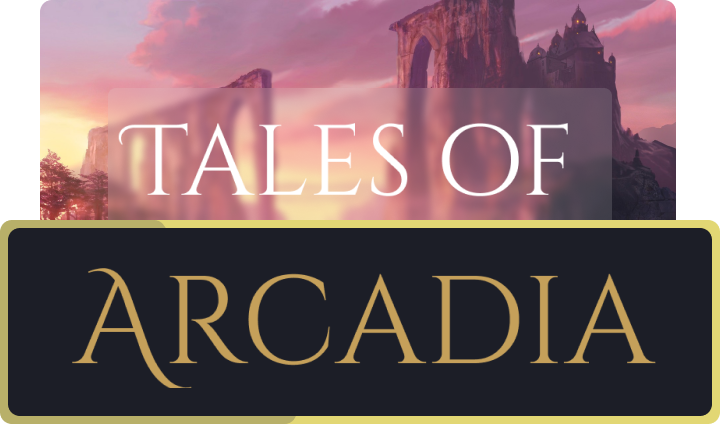

  

  
<i>"Don't worry, I'll see you on the other side!"</i>

  
  
  
  
  
  

  <h2 align="center">Welcome!:</h2>
  
Welcome to the offical github repo of the Tales of Arcadia game! This is the home for all the games code, if you would like to help form the future of this project please don't be afraid to create a pull request with your own game data or a feature request!

  
  <h2 align="center">Contributing:</h2>
  
In order to contibute to this project you will need a few things:

  
1. RPGMaker MV (on steam or standalone)

  
2. A PC to run RPGMaker on

  
3. A copy of the files in this repo (instructions to clone can be found below)

  
  <h2 align="center">About the game:</h2>
  <h3 align="center">Plot:</h3>
  <h3 align="center">Gameplay:</h3>
  <h3 align="center">Characters:</h3>
  
  <h2 align="center">Supporting the Project</h2>
  
I made this project open source for a reason. up until launch I don't want people to need to pay for my game. I feel that it is wrong to force people to pay for an unfinished product, so until the game is finished, it will remain free of charge. 
  However if you do want to support the project, you can do so in one of two ways:  
  1. Spread the word - This is a FREE and powerful way to help the project, the more people that know the beter :D 
  2. Donate to the project on Ko-Fi - <a href="https://ko-fi.com/thattakashi">https://ko-fi.com/thattakashi</a>

